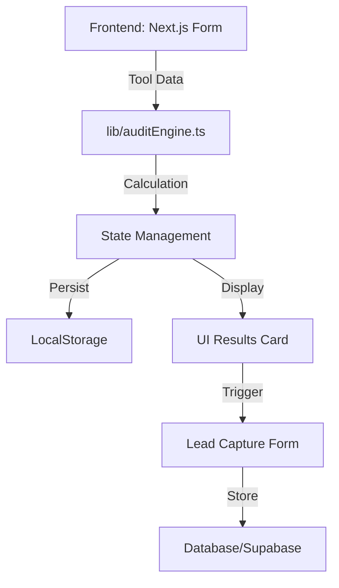

# Architecture
- **Frontend:** Next.js (App Router)
- **Styling:** Tailwind CSS + Shadcn UI
- **Database:** Supabase (planned)
- **AI:** Anthropic Claude API for audit summaries.
### Data Flow Diagram
